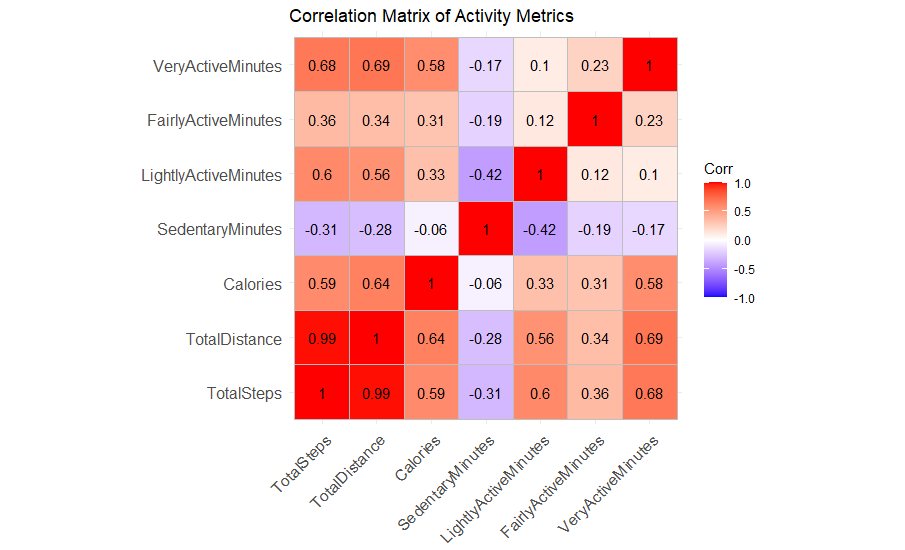

# Bellabeat Smart Device Usage Analysis

## Executive Summary
In this analysis, we examined the usage patterns of smart devices based on activity data from Fitbit users. Our key findings reveal insights into users' daily activity levels, the relationship between different activity metrics, patterns across different days of the week, and differences between active and sedentary days. Based on these insights, we propose several high-level recommendations to enhance Bellabeat's marketing strategy.

## Introduction
Bellabeat is a high-tech company that manufactures health-focused smart products for women. This project aims to analyze smart device usage data to gain insights into how consumers use their devices. These insights will help guide Bellabeat's marketing strategy and product development.

## Data Overview
We used public data from Fitbit fitness trackers, which includes personal tracker data from 30 users. The data covers minute-level output for physical activity, heart rate, and sleep monitoring, and includes information about daily activity, steps, and heart rate.

### Data Sources
- **Fitbit Fitness Tracker Data (CC0: Public Domain, dataset made available through Mobius):**
  - Date range: 3.12.16 - 5.12.16
  - Metrics: Total steps, total distance, calories burned, sedentary minutes, lightly active minutes, fairly active minutes, very active minutes.

## Key Findings
1. **Activity Levels:**
   - The average daily steps are approximately 6,547 steps.
   - The distribution of total steps shows a wide range of activity levels among users.

2. **Correlation Insights:**
   - A strong positive correlation exists between total steps and calories burned.

3. **Daily Patterns:**
   - Activity levels vary significantly across different days of the week, with users being more active on certain days.

4. **Active vs. Sedentary Days:**
   - Active days (defined as more than 10,000 steps) show significantly higher levels of total steps, distance, and calories burned compared to sedentary days.

5. **Time Series Trends:**
   - There are noticeable trends and variations in activity levels over the analyzed time period.
   
## Code for Analysis

### Load and Combine Data
```r
# Load necessary libraries
library(tidyverse)
library(lubridate)

# Define file paths
file_path1 <- "path_to_your_data_directory/Fitabase Data 3.12.16-4.11.16/dailyActivity_merged.csv"
file_path2 <- "path_to_your_data_directory/Fitabase Data 4.12.16-5.12.16/dailyActivity_merged.csv"

# Read the CSV files into data frames
daily_activity1 <- read_csv(file_path1)
daily_activity2 <- read_csv(file_path2)

# Combine the datasets
daily_activity_combined <- bind_rows(daily_activity1, daily_activity2)

# Convert ActivityDate to Date type
daily_activity_combined$ActivityDate <- mdy(daily_activity_combined$ActivityDate)

# Distribution of Total Steps
library(ggplot2)

ggplot(daily_activity_combined, aes(x = TotalSteps)) +
  geom_histogram(binwidth = 1000, fill = "blue", color = "white") +
  labs(title = "Distribution of Total Steps", x = "Total Steps", y = "Frequency") +
  theme_minimal()

# Correlation Heatmap
library(ggcorrplot)

cor_matrix_combined <- daily_activity_combined %>%
  select(TotalSteps, TotalDistance, Calories, SedentaryMinutes, LightlyActiveMinutes, FairlyActiveMinutes, VeryActiveMinutes) %>%
  cor(use = "complete.obs")

ggcorrplot(cor_matrix_combined, lab = TRUE) +
  labs(title = "Correlation Matrix of Activity Metrics")
```

```r
  
# Daily Patterns with units in the legend
daily_activity_combined$Weekday <- weekdays(daily_activity_combined$ActivityDate)

avg_by_day_combined <- daily_activity_combined %>%
  group_by(Weekday) %>%
  summarise(
    AvgTotalSteps = mean(TotalSteps, na.rm = TRUE),
    AvgTotalDistance = mean(TotalDistance, na.rm = TRUE) * 1000,  # Convert to meters
    AvgCalories = mean(Calories, na.rm = TRUE)
  )

avg_by_day_combined %>%
  gather(key = "Metric", value = "Value", -Weekday) %>%
  mutate(Metric = recode(Metric, 
                         "AvgTotalSteps" = "Average Total Steps", 
                         "AvgTotalDistance" = "Average Total Distance (meters)",
                         "AvgCalories" = "Average Calories")) %>%
  ggplot(aes(x = Weekday, y = Value, fill = Metric)) +
  geom_bar(stat = "identity", position = "dodge") +
  labs(title = "Average Metrics by Day of the Week", x = "Day of the Week", y = "Average Value") +
  theme_minimal()

# Active vs. Sedentary Days with units in the legend
threshold <- 10000

daily_activity_combined <- daily_activity_combined %>%
  mutate(DayType = ifelse(TotalSteps > threshold, "Active", "Sedentary"))

active_vs_sedentary_combined <- daily_activity_combined %>%
  group_by(DayType) %>%
  summarise(
    AvgTotalSteps = mean(TotalSteps, na.rm = TRUE),
    AvgTotalDistance = mean(TotalDistance, na.rm = TRUE) * 1000,  # Convert to meters
    AvgCalories = mean(Calories, na.rm = TRUE),
    AvgSedentaryMinutes = mean(SedentaryMinutes, na.rm = TRUE)
  )

active_vs_sedentary_combined %>%
  gather(key = "Metric", value = "Value", -DayType) %>%
  mutate(Metric = recode(Metric, 
                         "AvgTotalSteps" = "Average Total Steps", 
                         "AvgTotalDistance" = "Average Total Distance (meters)",
                         "AvgCalories" = "Average Calories",
                         "AvgSedentaryMinutes" = "Average Sedentary Minutes")) %>%
  ggplot(aes(x = DayType, y = Value, fill = DayType)) +
  geom_bar(stat = "identity", position = "dodge") +
  facet_wrap(~ Metric, scales = "free_y") +
  labs(title = "Comparison of Metrics on Active vs. Sedentary Days", x = "Day Type", y = "Average Value") +
  theme_minimal()

# Time Series Plot
ggplot(daily_activity_combined, aes(x = ActivityDate, y = TotalSteps)) +
  geom_line(color = "blue") +
  labs(title = "Time Series of Total Steps", x = "Date", y = "Total Steps") +
  theme_minimal()
```

## Recommendations
1. **Targeted Marketing:**
   - Promote features that encourage users to increase their daily steps, especially targeting days when users tend to be less active.

2. **Engagement Strategies:**
   - Develop challenges and campaigns that motivate users to achieve a daily step goal, leveraging insights from active versus sedentary days.

3. **Content Creation:**
   - Create content that educates users on the benefits of regular activity, supported by data insights on daily and weekly patterns.

4. **Feature Enhancements:**
   - Consider adding personalized insights and recommendations based on users' activity data to keep them engaged and motivated.

## Conclusion
This analysis provides valuable insights into how users engage with their smart devices and highlights opportunities for Bellabeat to enhance its marketing strategies and product offerings. By leveraging these insights, Bellabeat can better support its users in achieving their health and wellness goals.
